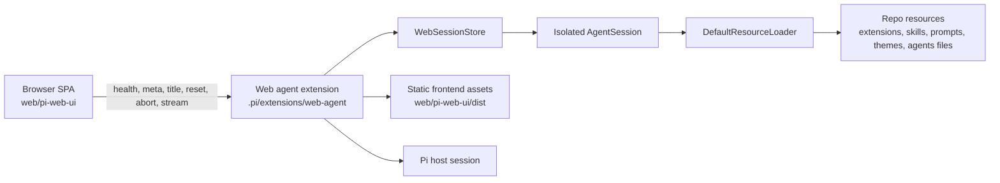
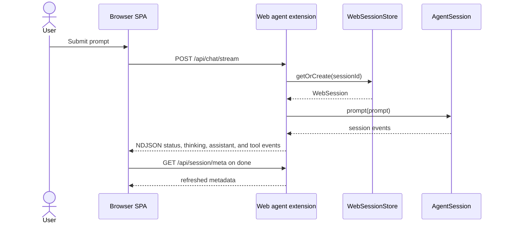

# Architecture

## System overview

Pi Web Access is a three-part local system:

- the Pi host runtime
- a local extension bridge that serves HTTP and NDJSON
- a browser SPA that consumes the bridge

The browser fetch layer is centralized in `web/pi-web-ui/src/lib/api.ts`.
That module owns every browser-side HTTP call: health, session metadata, title
updates, reset, abort, and stream creation.

## Runtime responsibilities

| Surface | Responsibility |
| --- | --- |
| `.pi/extensions/web-agent/index.ts` | Owns server lifecycle, route dispatch, stream setup, and static serving |
| `.pi/extensions/web-agent/config.ts` | Resolves host, port, token, static root, TTLs, and security headers |
| `.pi/extensions/web-agent/auth.ts` | Applies security headers and validates `x-pi-web-token` with timing-safe comparison |
| `.pi/extensions/web-agent/session-store.ts` | Creates, stores, resets, aborts, and expires isolated browser sessions |
| `.pi/extensions/web-agent/meta.ts` | Projects session metadata, slash commands, resource counts, and health |
| `.pi/extensions/web-agent/protocol.ts` | Translates Pi session events into browser NDJSON events |
| `web/pi-web-ui/src/lib/api.ts` | Central browser fetch layer and stream request creator |
| `web/pi-web-ui/src/hooks/use-session.ts` | Token bootstrap, metadata refresh, title update, and reset flow |
| `web/pi-web-ui/src/hooks/use-chat-stream.ts` | Streaming prompt flow, current-run assembly, transcript finalization, and stop |

## Request and stream flow

## Session model

- Each browser session is identified by a `web_*` session ID.
- The frontend stores the auth token in `sessionStorage`.
- The frontend stores the current browser `sessionId` in `localStorage`.
- The backend maps each browser `sessionId` to an isolated in-memory
  `AgentSession` plus a resource loader.
- Reset disposes the current browser session and allocates a fresh one.
- Idle sessions are expired by TTL cleanup in the session store.

## Security boundary

- `GET /health` is intentionally coarse and unauthenticated.
- `/api/*` routes require the configured token header.
- The bridge defaults to `127.0.0.1`.
- All responses carry restrictive headers, including CSP, `no-store`,
  `X-Frame-Options: DENY`, and `X-Content-Type-Options: nosniff`.
- Static assets are served from the built frontend directory with path traversal
  protection.

## Architecture notes from implementation and thoughts

- The final system matches the thought artifacts at a high level, but the live
  code is the canonical reference for exact route payloads and UI behavior.
- The backend translates Pi runtime events into a browser-specific contract
  instead of exposing raw runtime events directly.
- The frontend keeps live run state and finalized transcript history separate so
  partial output is not committed to history until the `done` event arrives.

That split between provisional and finalized state is central to the architecture.
