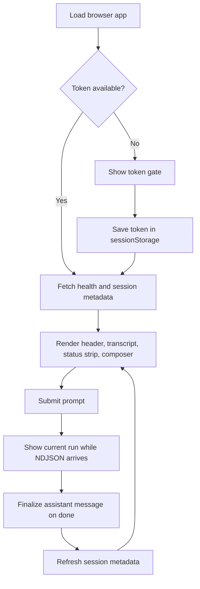

# Design

## Product intent

Pi Web Access is designed to make Pi usable from a browser while preserving the
mental model of a local coding agent. The browser experience should feel fast,
inspectable, and operationally honest: users can see status, live tool work,
session metadata, and the current run without hiding backend state transitions.

## Primary goals

- give Pi a browser-native chat surface
- preserve browser session isolation from terminal sessions
- stream assistant and tool activity incrementally
- expose enough metadata for trust and debugging
- keep the token and network model simple for local use

## Non-goals

- replacing the Pi terminal workflow
- turning the bridge into a remote multi-tenant service
- persisting browser credentials to disk by default
- inventing a second protocol when Pi runtime data can be normalized

## User journey

## Layout anatomy

The frontend is organized around five visible surfaces:

- token gate: collects the auth token when none is present
- header: shows session title, session ID, notifications toggle, and reset
- transcript history: finalized user and assistant messages
- current run: in-progress assistant text, thinking text, and tool cards
- footer composer: prompt input, slash command suggestions, connection state,
  stop, and send

On large screens, a right rail appears when todo or subagent activity exists.

## State model

- `useSession` owns token bootstrap, health, session metadata, title updates,
  and reset.
- `useChatStream` owns finalized transcript history, in-progress run state,
  side-panel activity, stream errors, and stop behavior.
- `module-activity.ts` normalizes side-channel tool output into todo and
  subagent views.
- The title heuristic is only a fallback. The backend remains the canonical
  owner of the persisted session title.

## Interaction design choices

- Send is explicit and also bound to `Meta+Enter` or `Ctrl+Enter`.
- Stop maps to backend abort rather than local stream cancellation only.
- Reset clears local chat state first, then asks the backend for a fresh
  browser session.
- Slash command suggestions are filtered from backend metadata but only web-safe
  built-in commands are enabled in the browser surface.
- Browser notifications only fire when the document is not focused and the user
  has granted permission.

## Design decisions carried forward from thoughts

- Keep the UI shell compact and operational rather than decorative.
- Surface status, usage, thinking level, and resource health in the main view
  instead of burying them in settings.
- Separate current-run state from transcript history so incomplete assistant
  output stays visibly provisional.
- Favor a thin browser fetch layer in `src/lib/api.ts` so request behavior and
  headers stay centralized.

The browser should always make the live state legible.
